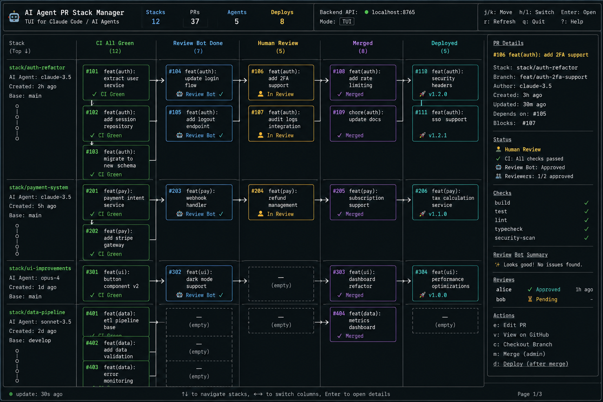
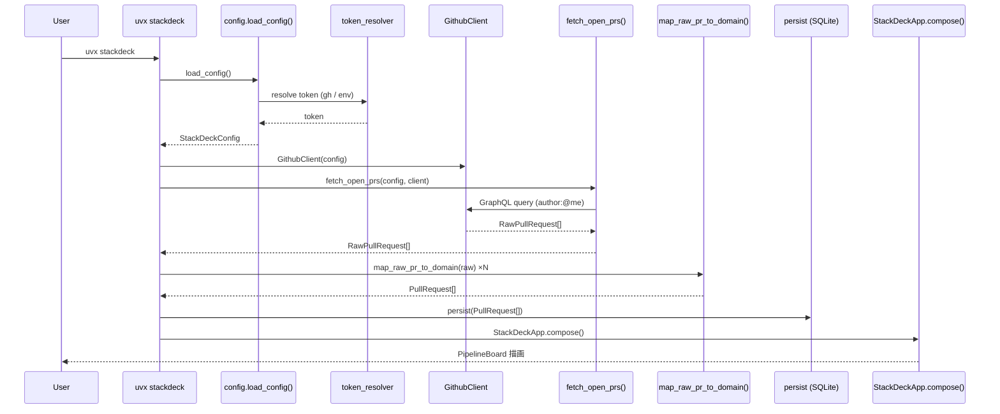
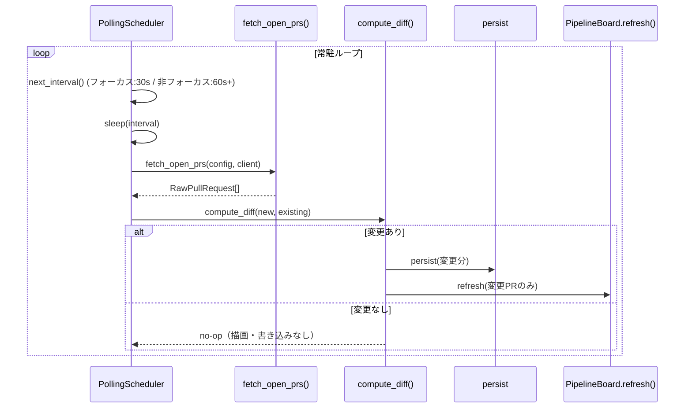
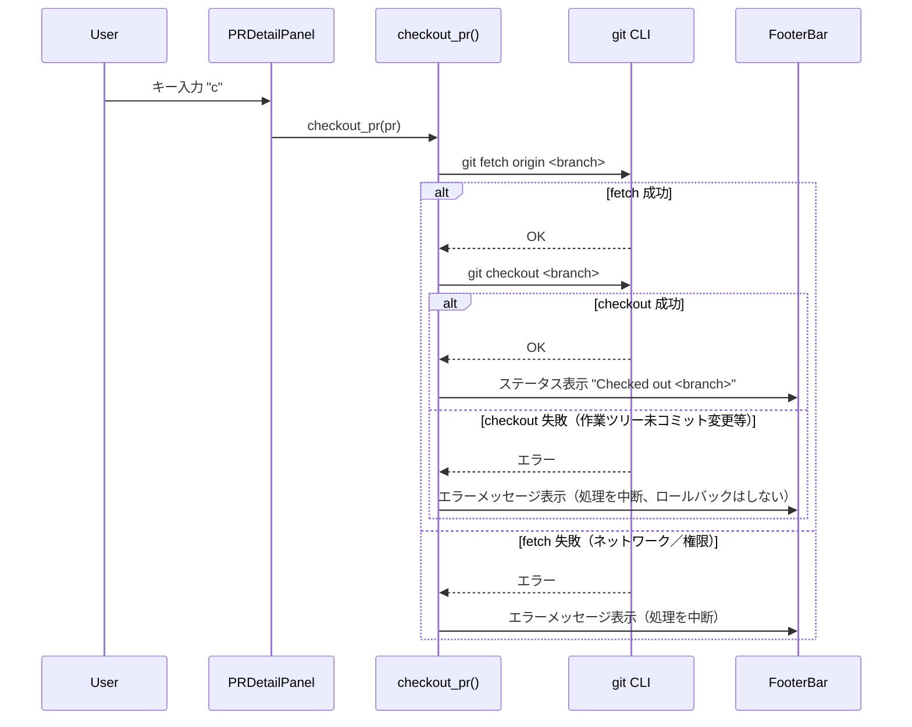
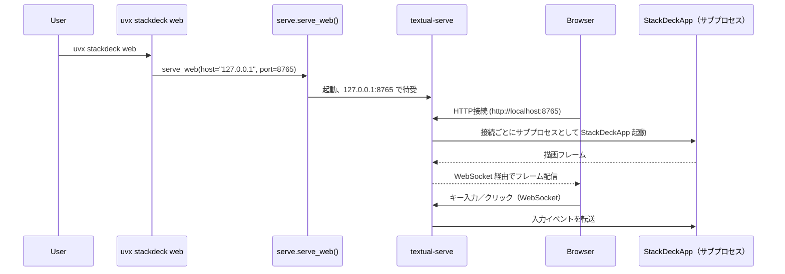
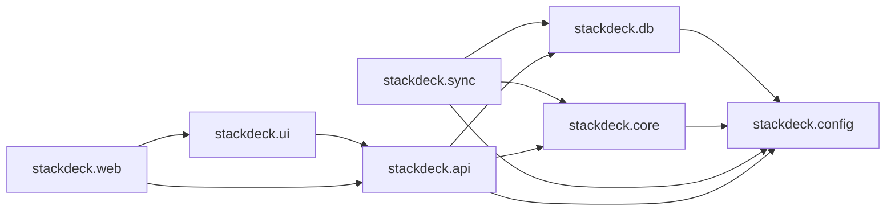

# StackDeck 設計ドキュメント



_↑ UI の完成イメージ。左=スタック一覧、中央=`CI All Green`→`Review Bot Done`→`Human Review`→`Merged` のパイプライン、右=選択中 PR の詳細。デプロイは独立列ではなく Merged カード上の 🚀 マーカーで表現される。ロードマップ Phase 1〜5 の視覚的到達点として本ドキュメントの正準リファレンスとして残す。_

StackDeck は、個人開発者が自分の担当する PR スタック（共通のベースブランチ上に連なる関連 PR のチェーン、しばしば Claude Code を複数並行実行して積み上げる）だけを、ローカル環境で Kanban 形式のターミナル UI（TUI）として俯瞰するための道具である。左パネルにスタック一覧とそのトポロジー、中央にパイプライン状態（`CI All Green` → `Review Bot Done` → `Human Review` → `Merged`）の列、右パネルに選択中 PR の詳細（依存関係・チェック結果・レビュー依頼状況・操作ショートカット）を表示する。デプロイ（リリース）は独立した列ではなく、Merge 済みかつリリースタグが付いた PR カード上に 🚀 アイコン + タグとして表す。モックはこの体験の視覚的リファレンスであり、本ドキュメントの UI 仕様（§7）はモックの構成要素に開発上の名前を与えるためのものである。

同じコアを **同一マシン上で Web サーバーとしても起動でき**、自分のブラウザからも同じ体験にアクセスできることが要件であり、本ドキュメントの技術選定・アーキテクチャはこの要件を起点に決定している。ただし対象は会社の統制下にある GitHub（Webhook 管理者権限なし、GitHub App のインストールは組織承認が必要、共有サーバーの運用も現実的でない）であるため、**ローカル実行・ポーリング・個人アカウントの Fine-grained PAT** を前提に設計する。

---

## 目的と非目的

**StackDeck が目指すもの**

- 自分（単一ユーザー）が担当する PR スタックの「今どこまで進んでいるか」を、設定ファイルで指定した数リポジトリを横断して一画面で把握できるローカルツール
- CI / レビューボット / 人間レビューという一連のパイプラインを Merge まで可視化し、Merge 後のリリース（Deploy）はカード上のマーカーとして扱う
- TUI をファーストクラスの体験としつつ、同一マシンの `localhost` にブラウザからもアクセスできるようにする（day 1 設計）
- 読み取り中心（observe）のツールとして、GitHub 上の実状態をポーリングで正確に反映する
- 会社の GitHub 統制（Webhook 管理者権限なし、GitHub App 承認制、共有インフラ不可）の下でも、個人の権限だけで完結して動く

**StackDeck が目指さないもの（非目的）**

- GitHub の PR UI そのものの置き換え（コードレビューのコメント作成・diff 表示などは GitHub / エディタに委ねる）
- **チームで共有するダッシュボードになること**（v1 は単一ユーザー・ローカル実行を前提とし、他者の PR や組織全体の可視化は対象外。「ロードマップ」の Phase 6 参照）
- v1 において AI エージェントを「起動・制御」するオーケストレーションツールになること（v1 は観測に徹する。§4, ロードマップ Phase 4 参照）
- 汎用 Git クライアントやマージツールになること、あるいは会社の PR 承認フロー（branch protection・required reviews）を迂回する手段になること（Merge/Deploy 操作は既存の CI/CD・GitHub API を薄く呼び出すのみで、使えない環境ではオプションとして無効化される）
- Webhook 受信サーバーや常駐の共有インフラを必要とすること（企業リポジトリでの Webhook 管理者権限・公開エンドポイント要件を避けるため、鮮度はポーリングのみで担保する）

---

## アーキテクチャ概要

TUI と将来の Web フロントエンドが同じ「読み取りモデル」を共有できるよう、GitHub 同期処理とドメインロジックをプレゼンテーション層から分離したレイヤード構成にする。

```
┌─────────────────────────────────────────────────────────────────┐
│                         GitHub API (REST / GraphQL v4)           │
│                (Fine-grained PAT / gh auth token で認証)          │
└───────────────────────────────┬───────────────────────────────────┘
                                 │ 低頻度ポーリング（adaptive interval）
                                 ▼
┌─────────────────────────────────────────────────────────────────┐
│  Sync Worker                                                     │
│   - GraphQL による差分取得、REST による補完                       │
│   - 設定ファイル（stackdeck.toml）で列挙された数リポジトリのみ対象  │
│   - author:@me 等のフィルタを常に適用してクエリコストを抑制         │
│   - スタック検出（base ブランチ連鎖 + Depends-on 規約）            │
└───────────────────────────────┬───────────────────────────────────┘
                                 ▼
┌─────────────────────────────────────────────────────────────────┐
│  Core Domain（Stacks / PullRequests / Checks / Reviews / Agents） │
│   - ドメインモデルと整合性ルール（DAG 構築、状態遷移）              │
└───────────────────────────────┬───────────────────────────────────┘
                                 ▼
┌─────────────────────────────────────────────────────────────────┐
│  Read Model（SQLite キャッシュ）                                  │
│   - 「キャッシュは使い捨て」= 削除しても Sync Worker が再構築可能   │
└───────────────────────────────┬───────────────────────────────────┘
                                 ▼
┌─────────────────────────────────────────────────────────────────┐
│  API Layer（pydantic スキーマで契約化、localhost:8765）           │
└───────────┬─────────────────────────────────────┬─────────────────┘
            ▼                                     ▼
      ┌───────────┐                         ┌───────────────┐
      │    TUI     │                        │   Web（将来）   │
      └───────────┘                         └───────────────┘
```

**共有の要（シーム）**: TUI・Web のどちらも「API Layer」だけを参照し、Core Domain / Sync Worker には直接触れない。v1 では TUI プロセス内で API Layer をインプロセス呼び出しするが、スキーマは pydantic モデルとして契約化しておくため、後日 API Layer を別プロセス・別ホストへ切り出しても呼び出し側のコードはほぼ変更不要になる。これが §5 の移行戦略の技術的根拠である。

---

## 技術選定

### 比較表

| 観点 | Python + Textual | Rust + Ratatui | Go + Bubble Tea | TypeScript + Ink |
|---|---|---|---|---|
| モックの視覚様式への忠実度 | 高（CSS 風スタイリングで角丸ボーダー・アクセントカラーを宣言的に記述） | 中〜高（`BorderType::Rounded` 等はあるが色・レイアウトは手組み） | 高（Lip Gloss が角丸ボーダー・グラデーション配色に強く、Charm 製品群の見た目の完成度が高い） | 中（yoga による Flexbox はあるが、装飾系の定番ライブラリは薄い） |
| 将来の Web 化のしやすさ | **最高**：`textual-serve`（自社謹製・MIT）で数行の変更なく既存 TUI をブラウザ配信可能。`textual-web` は公開 URL 配信までカバーするが beta（セッション非永続、レイテンシ課題あり） | 低：公式の Web 配信手段なし。WASM バックエンド（`ratatui-wasm-backend`, `egui_ratatui` 等）はコミュニティ実験段階 | 中：`wish` で SSH 配信は一級品だが、ブラウザ配信には ttyd/xterm.js 等の外部ブリッジが別途必要 | 低：Ink 自体はターミナル専用。DOM 版に流用できる設計ではない |
| シングルバイナリ配布 | 不可（Python ランタイム前提。`uvx`/`pipx` で擬似的に一発起動は可能） | 最高（`cargo build --release` で完結） | 最高（`go build` で完結、クロスコンパイルも容易） | 不可（Node ランタイム前提） |
| GitHub API との相性 | 良好（`httpx` + `gql` で GraphQL、REST は素の HTTP クライアントで容易） | 中（`octokit-rs`/`octocrab` はあるが機能追随がやや遅れる） | 良好（`google/go-github` が高品質で型安全、広く使われる） | 最高（`octokit.js` は GitHub 公式リファレンス実装） |
| Kanban 風レイアウトのエコシステム | 良好（`DataTable`/`Grid` レイアウトで多列 UI を組みやすい） | 中（列レイアウトの実例はあるが自前実装が多い） | **最高**：Charm 公式チュートリアル "kancli" がまさに Bubble Tea + Bubbles でのカンバンボード構築例 | 中（`ink-select-input` 等はあるが多列ダッシュボードの定番例が薄い） |
| 個人〜小規模チームでの保守負荷 | 低（型ヒント + pytest + 広いエコシステムで十分回る） | 中（所有権・非同期まわりの学習コストがやや高い） | 低（言語がシンプルで並行処理も書きやすい） | 中（React の心的モデルは持ち込めるが、CLI ツールとしての周辺整備＝引数解析等は自前が必要） |

### 決定

**採用: Python + Textual**

理由: StackDeck の要件は「同じコアを later で（同一マシン上の）Web サーバーとして配信する」ことと「個人開発者に馴染む形で素早く配布・改修できる」ことの両立であり、これを最小の実装コストで満たせるのは `textual-serve` を持つ Textual だけである。他候補（Ratatui, Bubble Tea）はいずれもブラウザ配信を自前でブリッジする必要があり、Web 化のコストがアーキテクチャ全体の見積もりを支配してしまう。加えて個人開発者向けの配布としては `pip install`/`uvx` が最も摩擦が少なく、視覚様式（角丸ボーダー・列ごとのアクセントカラー）も Textual の CSS ライクなスタイルシートで十分再現できる。

**次点: Go + Bubble Tea + Lip Gloss（+ wish）**

Charm 公式のカンバンボード構築チュートリアル "kancli" が本プロジェクトのユースケースに驚くほど近く、Lip Gloss の配色・角丸ボーダー表現力もモックの美観に最も近い。**もし将来「シングルバイナリを社内配布し、各メンバーがそれぞれ自分のマシンでローカル実行する」運用に舵を切るなら（＝ Web 配信の優先度が下がり、Python ランタイム不要の配布容易性を優先するなら）、Go + Bubble Tea を選び直すのが正解になる。** その場合の Web 化は `wish`（SSH）+ ttyd/xterm.js ブリッジ、または Core Domain を切り出した完全な shared-core 構成（§5 の Path A）を最初から採用する。

### 技術選定（コンポーネント別）

| コンポーネント | 採用 | 次点 | 次点が有利になる条件 |
|---|---|---|---|
| TUI フレームワーク | Textual | Bubble Tea | Web 配信より単一バイナリ配布と描画性能を優先する場合 |
| 内部 API 層 | FastAPI（pydantic スキーマで契約化、v1 はインプロセス呼び出し） | HTTP を挟まない素の Python モジュール境界 | Phase 0-1 のスピードを最優先し、shared-core 化を当面考えない場合 |
| DB | SQLite + SQLModel（SQLAlchemy + pydantic） | 素の `sqlite3` + 手書きリポジトリ層 | 依存を極小化し、マイグレーションツールの学習コストを避けたい場合 |
| GitHub クライアント | `httpx`（async）+ `gql`（GraphQL v4） | `PyGithub`（REST 専用、同期） | GraphQL のクエリ設計コストを払いたくない、初速優先の個人開発 |
| テスト | pytest + Textual 公式スナップショットテスト（`App.run_test()`）+ `respx` で GitHub HTTP モック | 標準 `unittest` + 手動モック | 依存追加を避けたい最小構成の場合 |
| パッケージング | `uv` + `pyproject.toml`（`uvx stackdeck` で実行） | `PyInstaller` によるシングルバイナリ化 | 「Python 不要」を配布上の必須要件にする場合（Phase 6 でのストレッチゴールとして再検討） |

---

## Web モード戦略

**主軸: Path B（TUI 自体を Web 配信する）＝ `textual-serve`、`127.0.0.1` バインド固定**

- v1〜Phase 5 の主軸として、Textual アプリをそのまま `textual-serve` で **同一マシンの `localhost:8765`** にバインドしてブラウザ配信する。ユーザー体験は「自分のターミナルをそのまま自分のブラウザで見る」形であり、モックが想定する monospace な TUI の質感をそのまま維持できる。第三者への共有や公開 URL 配信は想定しない。
- 実装コストが極めて小さい（アプリ本体を変更せず、配信プロセスを追加するだけ）ため、Phase 5 の立ち上げが速い。
- **`textual-web`（公開 URL 配信・トンネリング機能）は使わない**。会社リポジトリの情報を外部にトンネリングする経路自体が統制上のリスクになるため、意図的に採用しないと明記する。
- 既知の制約: `textual-serve` はローカル配信向け（サブプロセス起動 + WebSocket 通信）であり、モバイル最適化やレスポンシブなレイアウトは持たない。

**フォールバック: Path A（Core を切り出し、TUI と SPA を薄いクライアントにする）**

- API Layer（§3）がすでに pydantic スキーマで契約化されているため、Path A への移行は「新しい HTTP/WebSocket クライアント（自分専用の軽量 SPA 等）を `127.0.0.1` 上に追加するだけ」で済む。Core Domain・Read Model・Sync Worker には手を入れない。
- Path A を選ぶべきタイミング: (1) 自分の用途でもモバイル端末（ローカルネットワーク内）からのレスポンシブな閲覧が必要になったとき、(2) `textual-serve` のレイテンシ/描画制約が実運用で問題になったとき、(3) 複数リポジトリの横断ビューが増えて TUI のペイン数だけでは収まらない可視化（グラフ描画など）が欲しくなったとき。

**移行の道筋**: API Layer を最初から「HTTP で呼べる形」の契約として設計しておく（v1 ではインプロセス関数呼び出しでも、スキーマとエンドポイント境界は HTTP API として定義しておく）ことで、Path B → Path A への切り替えは「配信方式の追加」であり「作り直し」にならない。

---

## GitHub 連携

- **読み取り: GraphQL v4 を主軸、REST を補完**。PR・チェック・レビュー・依存 PR を 1 クエリでまとめて取得できるため REST の N+1 を避けられ、GraphQL のポイント制レート制限（5,000 pt/h、REST は 5,000 req/h）の下でも効率が良い。Merge 実行など GraphQL がカバーしない操作は REST を使う。
- **鮮度: 低頻度ポーリングに一本化（Webhook はサポートしない）**。企業リポジトリでは Webhook 管理者権限がない・公開エンドポイントを立てられない・共有サーバー運用が現実的でない、という制約があるため、Webhook 受信は最初から採用しない。代わりに **adaptive polling interval** を採用する: TUI がフォーカスされている（アクティブに見られている）間は 30 秒間隔、バックグラウンド/非フォーカス時は 60 秒以上に間引く。これによりレート制限消費と鮮度のバランスを取る。
- **認証: Fine-grained PAT を主軸**。対象リポジトリを明示選択できる Fine-grained personal access token を採用し、必要な権限は最小限に絞る（Contents: Read-only, Pull requests: Read-only, Metadata: Read-only、対象リポジトリのみにスコープ）。書き込みが必要になるのは Phase 4 の Checkout 以外のアクション（Merge/Deploy を実行する場合）のみで、v1〜Phase 3 は Read-only トークンで十分動作する。
- **代替の認証手段: `gh auth token` の再利用**。開発機に GitHub CLI (`gh`) が既に認証済みであれば、`gh auth token` で取得したトークンをそのまま借用するオプションを用意し、トークン発行の手間そのものを省けるようにする（`stackdeck.toml` の `token_source = "gh"`）。
- **対象リポジトリは設定ファイルで明示列挙する**（後述の `stackdeck.toml`）。ワイルドカードや組織全体の自動探索は行わない。これにより「アクセス可能な全リポジトリを勝手に舐める」ことを避け、統制上の説明責任を果たしやすくする。
- **表示フィルタは `author:@me` を既定で暗黙付与**。GraphQL/REST の検索クエリには常に「自分が author の PR」（設定でオプションとして assignee も含められる）というフィルタを付け、Draft PR の除外もオプションとして提供する。これによりクエリコスト・表示範囲の両方を「自分の担当分」に限定する。ヘッダーの `Stacks/PRs/Agents/Deploys` 集計もこのフィルタ後の値であり、リポジトリ全体の集計ではない。
- **スタック検出の規約**: **base ブランチの連鎖を正とする**。同一リポジトリ内の Open PR 群について `base.ref` を辿り、A → B → C のように base が前段の head と一致する PR 列を機械的に DAG として構築する。これは `git --update-refs`, ghstack, spr, Graphite のいずれのワークフローで作られたスタックでも追加の規約なしに機能する。ただし base 連鎖だけでは判別できないケース（同じ base を共有するが本当は独立した PR、あるいは意図的な非線形依存）のために、PR 本文に **`Depends-on: #123`** という明示的な行を書く規約を上乗せし、これを base 連鎖より優先度の高いオーバーライドとして扱う。Graphite 独自の内部メタデータ（ローカル git config やクラウド側で管理され、GitHub API からは安定して読み取れない）には依存しない。

### 設定ファイル（`stackdeck.toml` / `~/.config/stackdeck/config.toml`）

対象リポジトリと表示フィルタは、設定ファイルで明示的に指定する。マルチリポジトリ横断表示は v1 から標準機能とする（ロードマップ Phase 1 参照）。

```toml
[github]
token_source = "gh"  # or "env:STACKDECK_GITHUB_TOKEN"

[[repos]]
owner = "acme"
name  = "backend"

[[repos]]
owner = "acme"
name  = "frontend"

[filters]
# 表示するのは自分がauthor または assignee のPRだけ
author = "@me"
```

---

## AI エージェント連携

- **エージェント帰属の規約**: **ブランチ名プレフィックス `agent/<agent-name>/<slug>`**（例: `agent/claude-sonnet/auth-refactor`）を第一の判定材料とする。エージェント側の自動化にラベル付けを覚えさせる必要がなく、PR を見るだけで判別できるため取りこぼしが少ない。ラベル `agent:<name>` は、ブランチ命名規約に従っていない PR（人間が途中から引き継いだ場合など）向けの第二判定材料として併用する。v1 の主要ユースケースは「複数の異なる AI サービスが混在する」ことよりも、**1 人のユーザーが Claude Code を複数プロセスで並行実行し、それぞれが別スタックを担当する**ケースであり、`Agent` エンティティはその複数並行インスタンスを区別するために使う想定である（将来、他社エージェントが混在するケースにも同じ規約でそのまま対応できる）。
- **StackDeck はエージェントを「起動」しない（v1 は observe-first）**。"Review Bot を再実行" のようなアクションはエージェントの Webhook/API を呼び出す必要があり、認可・冪等性・失敗時のリトライ設計など別レイヤーの複雑さを持ち込む。v1〜Phase 3 は GitHub 上に既に存在する状態を観測するだけに留め、エージェント起動を伴うアクションは Phase 4 でオプトインの機能として慎重に追加する。
- **会社リポジトリでは TUI からの直接 Merge が実質使えないことが多い**。branch protection・required reviews・required status checks が設定されているリポジトリでは、たとえ API 経由でも承認要件を満たさない Merge はそもそも失敗する。StackDeck はこれを迂回する手段としては設計せず、あくまで「GitHub 側で Merge 可能になった PR に対する操作ショートカット」として位置づける（ロードマップ Phase 4 参照）。

---

## 永続化・状態

- **恒久化すべきもの**: (1) キャッシュされた PR/Check/Review スナップショット、(2) ユーザー設定（テーマ、表示列のフィルタ等）、(3) 直近のビュー状態（選択中スタック・スクロール位置など、再起動後の体験を滑らかにするため）。
- **DB**: SQLite + SQLModel を採用。「キャッシュは使い捨て」という境界を明確にする＝ PR/Check/Review テーブルはいつ消しても Sync Worker が GitHub から再構築できる設計とし、ユーザー設定テーブルとは物理的に区別する（別テーブル、将来的には別ファイルへの分離も検討）。
- マイグレーションは Alembic（SQLModel と親和性が高い）で管理する。

---

## スタイリング / テーマ

- Textual の CSS ライクなスタイルシート（`.tcss`）は、角丸ボーダー（`border: round`）・列ごとのアクセントカラー・Nerd Font グリフのフォールバック（Unicode 代替）を宣言的に記述でき、モックの美観を高い忠実度で再現できる。
- **デザイントークンを単一の情報源（Single Source of Truth）として YAML/JSON で定義**し、そこから (1) Textual 用の `.tcss` 変数、(2) 将来の Web SPA 用の CSS カスタムプロパティ（`--col-ci-green` 等）の両方を生成する。TUI と Web で色の見た目がずれることを構造的に防ぐ。
- 色トークンの命名は §7 に列挙する（`col-ci-green` など）。

---

## データモデル

| エンティティ | 主なフィールド | 備考 |
|---|---|---|
| `Stack` | `id`, `name`（例: `stack/auth-refactor`）, `base_branch`, `agent_id`, `created_at`, `pr_ids[]`（DAG 順） | base ブランチ連鎖 + `Depends-on` オーバーライドから構築 |
| `PullRequest` | `id`, `number`, `title`, `branch`, `base_branch`, `author_agent_id`, `is_draft: bool`, `assignees: [str]`, `status`（列挙: ci_green / review_bot_done / human_review / merged）, `depends_on[]`, `blocks[]`, `labels: [Label]`, `release_tag?: string`, `created_at`, `updated_at`, `url` | `status` は列（Kanban のカラム）と 1:1 対応。`is_draft`/`assignees` は表示フィルタ（`author:@me` に加え、自分が assignee のケースの拾い上げや Draft PR 除外オプション）に使う。`status = merged` かつ `release_tag` が設定されている場合にカード上へ 🚀 表示（§7）。Deploy 自体は独立した列ではなく `Deploy` エンティティ（後述）で追跡する |
| `Check` | `id`, `pr_id`, `name`（build/test/lint/typecheck/security-scan）, `conclusion`, `started_at`, `completed_at`, `details_url` | GraphQL の `checkSuites` から取得 |
| `Review` | `id`, `pr_id`, `reviewer`（レビュアーの名前/ハンドル）, `reviewer_type`（`human` / `review_bot`）, `state`（`pending` / `approved` / `changes_requested` / `commented`）, `summary`, `requested_at`, `responded_at?`, `age`（`pending` の場合のみ意味を持つ派生値 = `now - requested_at`） | レビューボットのサマリも同じ形で保持。`age` は永続化せず参照時に計算する派生フィールド |
| `Label` | `key`, `value?`, `source`（`"human"` または `"agent:<name>"`）, `created_at` | AI エージェントが付与するラベル（例: `agent:refactor`, `risk:low`, `area:auth`）とヒト由来ラベルを区別して保持。`PullRequest.labels` として多対一 |
| `Agent` | `id`, `name`（例: `claude-sonnet-4.5`）, `kind`（`claude-code`/`other`）, `first_seen_at` | ブランチプレフィックス／ラベルから解決 |
| `Deploy` | `id`, `pr_id`, `environment`, `status`, `release_tag`, `deployed_at`, `url` | Deployment API のポーリングで取得。UI 上はパイプラインの列ではなく、Merge 済みカードの 🚀 マーカーとして表現される（§7） |

**スタック検出の正準規約（再掲）**: base ブランチ連鎖を第一級の信号とし、PR 本文の `Depends-on: #123` 行を明示的なオーバーライドとして扱う。

---

## UI 仕様

冒頭の [UI モック画像](./mock/stackdeck-ui-mock.png) が本仕様の視覚的な正準リファレンスであり、以下の ASCII 図は同じ内容を実装者が参照しやすい形で表したものである。齟齬があった場合はモック画像を優先する。

### レイアウト（モック準拠、部品名を定義）

```
┌ HeaderBar ─────────────────────────────────────────────────────────────────┐
│ Stacks:3  PRs:12  Agents:2  Deploys:5   API: localhost:8765   Mode: TUI     │
│ Filter: [ label ▾ ]   Group by: [ label ▾ ]     j/k Move  h/l Switch  ...   │
├───────────────┬──────────────────────────────────────────────┬─────────────┤
│ StackListPanel│               PipelineBoard                  │PRDetailPanel│
│               │  CI All Green │ Review Bot Done │ Human Review│ Merged     ││
│ stack/auth-.. │  ┌──────────┐ │  ┌───────────┐  │ ┌──────────┐│┌──────────┐││ branch: ...
│  StackTopo    │  │#123 title│ │  │#122 title │  │ │#121 title││#120 title│││ author: ...
│  Graph        │  │[risk:low]│→│  │[area:auth]│ →│ │👥1/2·⏱3h ││🚀 v1.2.0 │││ Depends on/
│               │  └──────────┘ │  └───────────┘  │ └──────────┘│└──────────┘││ Blocks ...
├───────────────┴──────────────────────────────────────────────┴─────────────┤
│ FooterBar: 最終更新 12:34:56   j/k Move  Enter Open   1/3 pages             │
└──────────────────────────────────────────────────────────────────────────┘
```

- **`StackListPanel`**（左パネル）: スタック一覧。各行に `agent_id`, `created_at`, `base_branch`、および `StackTopologyGraph`（縦方向のミニ DAG）を表示。
- **`PipelineBoard`**（中央）: 列 `CI All Green` / `Review Bot Done` / `Human Review` / `Merged` の 4 列から成る Kanban（デプロイ専用の列は持たない）。各列は `PRCard`（`id`, `title`, ラベルチップ、レビューサマリチップ、必要に応じて 🚀 マーカー）を保持し、同一スタックに属するカードは列を跨いで矢印（`StackFlowArrow`）で接続される。
- **`PRDetailPanel`**（右パネル）: 選択中 PR の詳細。`branch`, `author`（エージェント名）, `created_at`/`updated_at`, `Depends on` / `Blocks`（DAG エッジ）, `status`, 個別チェック結果（build/test/lint/typecheck/security-scan）, ラベル一覧, `ReviewRequestStatus`（レビュー依頼状況、後述）, アクションショートカット（Edit / View on GitHub / Checkout / Merge / Deploy）。
- **`HeaderBar`**（ヘッダー）: 集計（Stacks / PRs / Agents / **Deploys** — Merge 済みかつリリース済み（released）の PR 数を指す。いずれも `author:@me` フィルタ適用後、すなわち自分の担当分に閉じた集計であり、設定ファイルで指定したリポジトリ全体の集計ではない）、ラベルバー（`Filter: [ label ▾ ]  Group by: [ label ▾ ]`）、バックエンド API エンドポイント（`localhost:8765`、`127.0.0.1` バインド固定）、現在のモード（TUI / Web）、キーバインド凡例。
- **`FooterBar`**（フッター）: 最終更新時刻、コンテキストに応じたキーヒント、ページネーション。

### レビュー依頼状況（`ReviewRequestStatus`）

`PRDetailPanel` は依頼済みレビュアーごとに以下を一覧表示する。

- レビュアー名/ハンドル（`Review.reviewer`）
- 状態: `Pending` / `Approved` / `Changes requested` / `Commented`
- 依頼からの経過時間（`Pending` の場合のみ）: `requested_at` からの経過を `⏱ 3h` / `⏱ 2d` のように表示し、応答があれば `responded_at` を示す

`PRCard`（カンバン上のカード）ではこれを 1 行に圧縮し、**レビュアー数（承認済み/依頼総数）と最も長く待たされている `Pending` の経過時間**だけを表示する: `👥 1/2 · ⏱ 3h`。この圧縮表示は `Review Bot Done` / `Human Review` 列のカードにのみ出す（`CI All Green` 列やレビュー未依頼の PR では非表示）。

### カード内表示ルール

カードは「今いる列」で自明な情報を繰り返さない。実装者は以下のルールに従うこと。

- `CI All Green` 列のカードに `✓ CI Green` のようなチップを重ねて表示しない（列自体がそれを示している）。
- `Review Bot Done` 列のカードに `Review Bot ✓` を重ねて表示しない。
- `Human Review` 列のカードに `In Review` を重ねて表示しない。
- カード本文に出してよいのは次の要素のみ: PR `id`、`title`、ラベルチップ（色付き、`Label.source` に応じて人間/エージェントを区別可能にする）、レビュー依頼状況の圧縮チップ（`👥 1/2 · ⏱ 3h`、`Review Bot Done`/`Human Review` 列のみ）、および `Merged` 列でリリース済みの場合の 🚀 マーカー + リリースタグ（例: `🚀 v1.2.0`）。

### ラベルによるフィルタ／グルーピング

AI エージェントは PR に自らラベル（例: `agent:refactor`, `risk:low`, `area:auth`）を付与できる。`HeaderBar` のラベルバーから、これらのラベル（人間由来・エージェント由来を問わず）でスタック/PR を絞り込み（`Filter`）、あるいはグループ化（`Group by`）できる。

### キーバインド（原文どおり + ラベル操作）

- `j/k` … Move
- `h/l` … Switch
- `Enter` … Open
- `r` … Refresh
- `q` … Quit
- `?` … Help
- `f` … Filter（ラベルによる絞り込み）
- `g` … Group by（ラベルによるグルーピング）

### 色トークン

| トークン | 用途 |
|---|---|
| `col-ci-green` | `CI All Green` 列のアクセント |
| `col-review-blue` | `Review Bot Done` 列のアクセント |
| `col-review-orange` | `Human Review` 列のアクセント |
| `col-merged-purple` | `Merged` 列のアクセント |
| `col-deploy-teal` | 列アクセントではなく、Merge 済みカード上の 🚀 リリースマーカー + リリースタグの配色（独立した列を持たないため用途を変更） |

---

## ロードマップ

### Phase 0 — Skeleton
- リポジトリ雛形（`pyproject.toml`, `uv` 設定, ディレクトリ構成）
- CI（lint + pytest を GitHub Actions で実行）
- Textual "hello board"（`HeaderBar`/`PipelineBoard`/`FooterBar` の空実装が起動する）
- SQLite マイグレーション基盤（Alembic 初期スキーマ）
- 設定ローダー（GitHub トークン、対象リポジトリ、ポーリング間隔）

**Exit criteria**: `uvx stackdeck` で空のボードが起動し、CI が green である。

### Phase 1 — Read-only TUI MVP（マルチリポジトリ横断表示を含む）
- `stackdeck.toml` に列挙した**複数リポジトリ**を横断して Open PR を GraphQL で取得（`author:@me` フィルタを適用）
- `PipelineBoard` に実データを描画（列へのマッピングは CI 状態のみで簡易判定、リポジトリを跨いだカードを同一ボードに表示）
- `PRDetailPanel` の基本表示（チェック結果・レビュー状況）
- 全キーバインド（`j/k/h/l/Enter/r/q/?`）の実装
- 書き込み系操作は一切なし（Fine-grained PAT は Read-only 権限で足りる）

**Exit criteria**: 設定ファイルで指定した複数リポジトリの自分の PR が、リポジトリを横断して正しい列に表示される。

### Phase 2 — Stack awareness
- base ブランチ連鎖によるスタック検出
- `Depends-on:` オーバーライドの解析
- `StackTopologyGraph`（DAG 描画）
- 依存関係を踏まえた列配置（前段が Merge されるまで後段を適切な状態として表示）

**Exit criteria**: 3 段以上のスタックが `StackListPanel` に正しいトポロジーで表示され、依存未解決の PR が誤った列に出ない。

### Phase 3 — Live sync（ポーリング + adaptive interval）
- adaptive polling interval の実装（フォーカス時 30 秒 / バックグラウンド時 60 秒以上）
- 差分検出・部分更新ロジック（毎回全件再取得しない）
- ブランチプレフィックス／ラベルによるエージェント帰属の解決

**Exit criteria**: フォーカス中は 30〜60 秒以内に GitHub 上の変更がボードへ反映され、レート制限に抵触しない。

### Phase 4 — Actions（Checkout は必須、Merge/Deploy はオプション）
- `Checkout`（ローカルへのブランチ取得）… **必須**
- `Merge`（GitHub API 経由。branch protection 等で使えない環境では機能を無効化し、GitHub 側へのリンク表示に留める）… オプション
- `Deploy`（既存 CI/CD トリガーの起動。環境が対応している場合のみ有効化）… オプション
- `Edit PR`（タイトル・base ブランチ等の変更）… オプション
- （オプトイン、要検討）エージェント起動アクション（例: Review Bot 再実行）の実験的追加

**Exit criteria**: TUI から Checkout が確実に動作する。Merge/Deploy が使える環境ではそれも実行でき、結果が GitHub 側の実状態と一致する。ただし本ツールは PR 承認フローを迂回する目的では作らないため、承認要件を満たさない Merge は GitHub 側と同様に失敗する。

### Phase 5 — Web mode
- `textual-serve` によるブラウザ配信の有効化（Path B、`127.0.0.1` バインド固定）
- API Layer のスキーマ固定（Path A への切替に備えた契約の凍結）
- `textual-web`（公開 URL 配信）を使わないことの動作確認（外部トンネリング経路が存在しないこと）

**Exit criteria**: 同一の Textual アプリがターミナルと `localhost` 経由のブラウザの両方で同じ操作感で動作し、外部からアクセスできないことを確認できる。

### Phase 6 — スケール・運用の硬化
- 監視リポジトリ数が増えた場合（10+ リポジトリ）のレート制限予算管理（GraphQL ポイント配分・ポーリング間隔の動的調整）
- `stackdeck.toml` の設定バリデーション・エラーメッセージ強化（リポジトリ増減時のメンテ負担を軽減）
- （必要であれば）Path A への本格移行、または PyInstaller によるシングルバイナリ配布の再検討
- 備考: マルチユーザー・チーム共有機能は本ドキュメントの非目的（§2）であり、v1〜Phase 6 のスコープには含めない。将来要件が変わった場合のみ再検討する

**Exit criteria**: 10 リポジトリを設定ファイルに列挙してもレート制限エラーを起こさずに安定稼働する。

---

## シーケンス図 (主要フロー)

以下は §3（アーキテクチャ概要）・§6（GitHub 連携)・§8（AI エージェント連携)・§5（Web モード戦略）で述べた設計を、代表的な 4 つのフローに沿って時系列で示したものである。実装時の関数名・モジュール境界は「主要インターフェース仕様」（後述）と一致させる。

**1. 初回起動シーケンス**: CLI 起動から設定ロード・GitHub からの初期データ取得・永続化・初期描画までの一連の流れ。



**2. Adaptive polling ループ**: フォーカス状態に応じた間隔でポーリングし、差分がある場合のみ永続化と再描画を行う。



**3. Checkout アクション**: ユーザー操作からローカルブランチ取得までのハッピーパスと、fetch/checkout それぞれの失敗時の分岐。



**4. Web モード起動**: `textual-serve`（Path B、§5 参照）による同一マシン内ブラウザ配信の起動シーケンス。



---

## モジュール依存図

`src/stackdeck/` 配下の主要パッケージ間の import 方向を DAG として示す。矢印は「上流パッケージが下流パッケージを import する」向き。



**ルール**: `config` / `db` / `core` は下流（`sync` / `api` / `ui` / `web`）を import してはならず、循環依存を作ってはならない。`core` は GitHub や SQLite の詳細を一切知らないドメイン層として維持し、`sync` が GitHub 側の生データを `core` のドメインモデルに変換して初めて `db` へ渡す。

---

## 主要インターフェース仕様

以下は公開関数・クラスのシグネチャのみを抜粋したものであり、実装の詳細（内部ロジック・エラー処理の中身）はここには含めない。型は Python 3.11+ 構文を用いる。

```python
# stackdeck/config.py
def load_config(path: str | None = None) -> StackDeckConfig:
    """設定ファイルとトークン解決を行い StackDeckConfig を返す。"""


# stackdeck/sync/github_client.py
class GithubClient:
    def __init__(self, token: str, base_url: str = "https://api.github.com") -> None:
        """認証済みの GraphQL/REST クライアントを初期化する。"""

    async def query(self, query: str, variables: dict[str, object]) -> dict[str, object]:
        """GraphQL クエリを実行する。"""

    async def rest(self, method: str, path: str, **kwargs: object) -> dict[str, object]:
        """REST エンドポイントを呼び出す。"""


# stackdeck/sync/fetch.py
async def fetch_open_prs(config: StackDeckConfig, client: GithubClient) -> list[RawPullRequest]:
    """設定済みリポジトリ群から Open PR の生データを取得する。"""


# stackdeck/core/mapping.py
def map_raw_pr_to_domain(raw: RawPullRequest) -> PullRequest:
    """GitHub API の生データをドメインモデル PullRequest に変換する。"""

def determine_status(pr: PullRequest) -> PRStatus:
    """PR の状態からパイプライン上の列（PRStatus）を判定する。"""


# stackdeck/core/stack_detection.py
def build_stacks_from_base_chain(prs: list[PullRequest]) -> list[Stack]:
    """base ブランチ連鎖と Depends-on オーバーライドから Stack の DAG を構築する。"""


# stackdeck/core/depends_on.py
def parse_depends_on(body: str) -> list[int]:
    """PR 本文から `Depends-on: #123` 形式の PR 番号を抽出する。"""


# stackdeck/sync/scheduler.py
class PollingScheduler:
    def next_interval(self) -> float:
        """フォーカス状態に応じた次回ポーリング間隔（秒）を返す。"""


# stackdeck/sync/diff.py
def compute_diff(new: list[PullRequest], existing: list[PullRequest]) -> Diff:
    """新旧の PR 一覧を比較し、変更差分（Diff）を算出する。"""


# stackdeck/core/agent_resolution.py
def resolve_agent(pr: PullRequest) -> Agent | None:
    """ブランチプレフィックス／ラベルから PR の担当エージェントを解決する。"""


# stackdeck/core/actions.py
def checkout(pr: PullRequest) -> ActionResult:
    """対象 PR のブランチをローカルに fetch + checkout する。"""

def merge(pr: PullRequest, client: GithubClient) -> ActionResult:
    """GitHub API 経由で PR を merge する。"""

def deploy(pr: PullRequest, client: GithubClient) -> ActionResult:
    """既存 CI/CD のデプロイトリガーを起動する。"""

def edit_pr(pr: PullRequest, client: GithubClient, **changes: object) -> ActionResult:
    """PR のタイトル／base ブランチ等を変更する。"""


# stackdeck/api/routes.py
@router.get("/stacks")
async def get_stacks() -> list[Stack]:
    """全スタックの一覧を返す。"""

@router.get("/prs")
async def get_prs(stack_id: str | None = None) -> list[PullRequest]:
    """PR 一覧を返す（stack_id 指定でそのスタックに絞り込み）。"""

@router.get("/prs/{pr_id}")
async def get_pr_detail(pr_id: str) -> PullRequest:
    """単一 PR の詳細を返す。"""

@router.get("/agents")
async def get_agents() -> list[Agent]:
    """エージェント一覧を返す。"""


# stackdeck/web/serve.py
def serve_web(host: str = "127.0.0.1", port: int = 8765) -> None:
    """textual-serve 経由で StackDeckApp をブラウザ配信する。"""
```

---

## エラーハンドリング方針

- 回復可能なエラー（単一 PR のデータ欠損・不整合、GraphQL の部分的エラーなど）は警告ログを出してその PR だけをスキップし、ボード全体の描画は継続する（1件の壊れたデータで全体を落とさない）。
- 回復不可能なエラー（設定ファイル不備、トークン未設定・認証失敗）は起動時に即 fail-fast し、原因を明示した例外を送出して終了する（不完全な状態で起動を続けない）。
- GitHub API のレート制限（429 / `x-ratelimit-remaining: 0`）は自動リトライしない。adaptive polling（本章「Adaptive polling ループ」参照）が次回間隔まで待つことで自然にバックオフする設計とし、リトライロジックの複雑さを持ち込まない。
- Webhook 受信に関するエラーハンドリングは存在しない（§2 の非目的・§6 の方針により Webhook 自体を採用しないため、対応する例外系・リトライ系のコードは実装しない）。
- ログレベル方針: `INFO` = 状態変化（起動・ポーリング結果反映・アクション成功など）、`WARNING` = 単一 PR のスキップ・部分的なデータ欠損、`ERROR` = fail-fast に至る前段の致命的な状況。

---

## テスト戦略

- **ユニットテスト**: `tests/{config,db,sync,core,ui,api,web}/test_*.py` に配置し、`uv run pytest -q` のみで完結させる。外部ネットワーク通信は行わない。
- **HTTP モック**: GitHub API（GraphQL/REST）は `respx` でモックし、Sync Worker・GithubClient のテストを決定的にする。
- **Textual テスト**: `App.run_test()` で `StackDeckApp` を起動し、`pilot.press()` / `pilot.pause()` / `pilot.click()` でキー操作・クリックをシミュレートする。
- **スナップショットテスト**: Textual 公式のスナップショットテスト（`pytest-textual-snapshot`）を Phase 1 以降で導入し、`PipelineBoard`/`PRDetailPanel` の視覚的リグレッションを検知する。
- **統合テスト**: `tests/integration/` に、fetch → map → persist → UI 描画までを end-to-end で通すテストを置く。GitHub 呼び出しは `respx` モック、永続化層は in-memory SQLite を用い、外部依存なしで再現可能にする。
- **手動確認が必要な項目**（実 GitHub トークンでの疎通確認、実ブラウザでの `textual-serve` 動作確認など、自動テストで代替できないもの）は `docs/MANUAL-TESTS.md` に別途列挙する運用とする。本ドキュメントの追記範囲ではファイルの新規作成は行わない。

---

## 決定ログ (ADR-lite)

**ADR-001: Textual を採用する**
- Context: TUI フレームワークの選定（比較対象は Ratatui / Bubble Tea / Ink）。
- Decision: Python + Textual を採用する（次点: Go + Bubble Tea）。
- Consequences: `textual-serve` により Web 配信コストが最小になる一方、シングルバイナリ配布はできない。詳細は「技術選定」参照。

**ADR-002: Webhook を採用せず polling 一本化**
- Context: 企業リポジトリでは Webhook 管理者権限がなく公開エンドポイントも立てられない。
- Decision: Webhook を採用せず、adaptive polling interval（フォーカス時30秒/非フォーカス時60秒以上）のみで鮮度を担保する。
- Consequences: 最大1分弱の反映遅延が生じる代わりに、統制上のリスク（Webhook 権限・公開エンドポイント）を回避できる。詳細は「GitHub 連携」参照。

**ADR-003: 認証を Fine-grained PAT / `gh auth token` に限定**
- Context: 会社統制下の GitHub では GitHub App のインストールが組織承認制で、共有サーバー運用も現実的でない。
- Decision: 認証手段を Fine-grained PAT（Read-only スコープ主軸）と `gh auth token` の借用に限定する。
- Consequences: 個人の権限のみで完結して動作するが、組織が PAT 発行自体を制限する場合は利用できないおそれがある。詳細は「GitHub 連携」および「リスクと未決事項」参照。

**ADR-004: スタック検出は base 連鎖 + Depends-on オーバーライド**
- Context: ghstack/spr/Graphite など複数のスタッキングワークフローに追加規約なしで対応したい。
- Decision: base ブランチ連鎖を第一級の信号とし、PR本文の `Depends-on: #123` を優先度の高い明示的オーバーライドとして扱う。
- Consequences: 大半のケースで規約追加なしに機能するが、両者の規約に従わない PR では帰属・依存が誤判定されうる。詳細は「GitHub 連携」「データモデル」参照。

**ADR-005: v1 は observe-first（エージェントを起動しない）**
- Context: エージェントの起動・制御には認可・冪等性・失敗時リトライなど別レイヤーの複雑さが伴う。
- Decision: v1〜Phase 3 は GitHub 上の既存状態を観測するだけに留め、エージェント起動を伴うアクションは Phase 4 でオプトインとして慎重に追加する。
- Consequences: v1 のスコープを小さく保てる一方、"Review Bot を再実行" 等の操作は当面提供されない。詳細は「AI エージェント連携」「ロードマップ」参照。

---

## リスクと未決事項

- **会社ポリシーによる Fine-grained PAT 発行制限**: 組織によっては Fine-grained PAT の発行自体を禁止・制限している、あるいは対象リポジトリの選択が組織承認制になっている可能性があり、その場合は `gh auth token` 経由の借用も含めて認証手段が使えなくなるおそれがある。
- **ポーリング一本化による鮮度（30〜60 秒遅延）が UX として許容範囲か未検証**: Webhook を使わない設計上、CI 完了やレビュー応答の反映に最大 1 分弱のラグが生じる。これがダッシュボードとしての実用性を損なわないか、実運用での検証が必要。
- **設定ファイルでのリポジトリ列挙のメンテ負担**: 担当リポジトリが増減する現場では `stackdeck.toml` の手動更新が漏れ、対象リポジトリが古いままになるリスクがある。
- **GraphQL レート制限の見積もり誤差**: PR 数・チェック数が多いリポジトリでは 1 クエリのポイントコストが想定より高くなる可能性があり、Phase 3 のポーリング間隔設計時に実測が必要。
- **エージェント帰属の信頼性**: ブランチプレフィックス規約はエージェント側の実装に依存するため、規約に従わない PR（人間の手動介入など）で帰属が誤判定される可能性がある。
- **`textual-serve` の実運用制約**: サブプロセス起動 + WebSocket 方式のため、長時間セッションでの安定性が実運用でどこまで持つか未検証。
- **`Depends-on:` 規約の遵守**: 人間・エージェント双方がこの規約を確実に守るとは限らず、base 連鎖だけでは解決できない複雑な依存関係が見逃される可能性がある。
- **Merge/Deploy アクションの誤操作リスク**: Phase 4 でオプションとして書き込み系操作を有効化する際、TUI 上の誤操作（キー押し間違い等）が本番環境に影響しうるため、確認ダイアログや取り消し不能操作の明示が必要。

---

## 参考リンク

- [GitHub - Textualize/textual-serve](https://github.com/Textualize/textual-serve)
- [textual-serve-asgi · PyPI](https://pypi.org/project/textual-serve-asgi/)
- [GitHub - ratatui/ratatui Wasm support discussion #640](https://github.com/ratatui/ratatui/discussions/640)
- [GitHub - NfNitLoop/ratatui-wasm-backend](https://github.com/NfNitLoop/ratatui-wasm-backend)
- [GitHub - charmbracelet/wish](https://github.com/charmbracelet/wish)
- [GitHub - charmbracelet/bubbletea](https://github.com/charmbracelet/bubbletea)
- [Bubble Tea v2: 10x Faster Terminal UIs for Go Developers](https://byteiota.com/bubble-tea-v2-10x-faster-terminal-uis-for-go-developers/)
- [GitHub - vadimdemedes/ink](https://github.com/vadimdemedes/ink)
- [Rate limits and node limits for the GraphQL API - GitHub Docs](https://docs.github.com/en/enterprise-cloud@latest/graphql/overview/rate-limits-and-node-limits-for-the-graphql-api)
- [Rate limits for the REST API - GitHub Docs](https://docs.github.com/en/rest/using-the-rest-api/rate-limits-for-the-rest-api)
- [Permissions required for fine-grained personal access tokens - GitHub Docs](https://docs.github.com/en/rest/authentication/permissions-required-for-fine-grained-personal-access-tokens)
- [gh auth token - GitHub CLI Manual](https://cli.github.com/manual/gh_auth_token)
- [The stacking workflow — stacking.dev](https://www.stacking.dev/)
- [Best Practices For Reviewing Stacked PRs - Graphite](https://graphite.com/docs/best-practices-for-reviewing-stacks)
